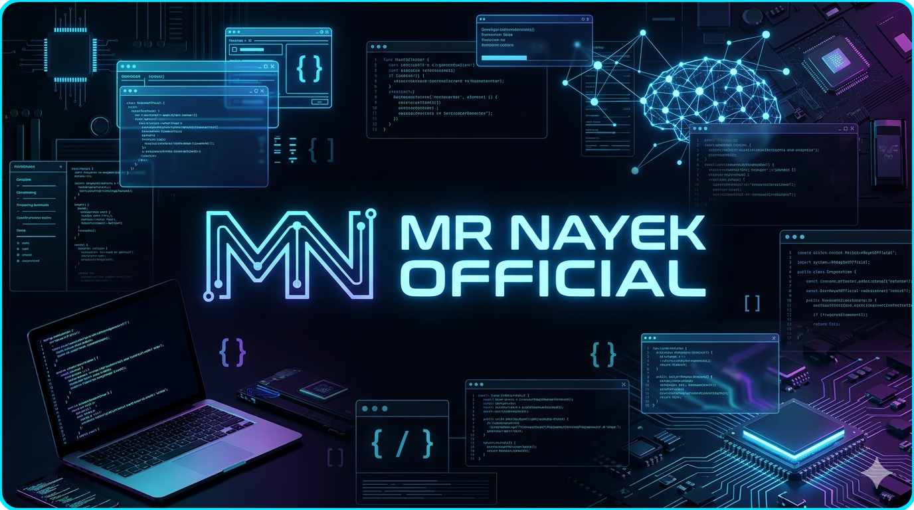
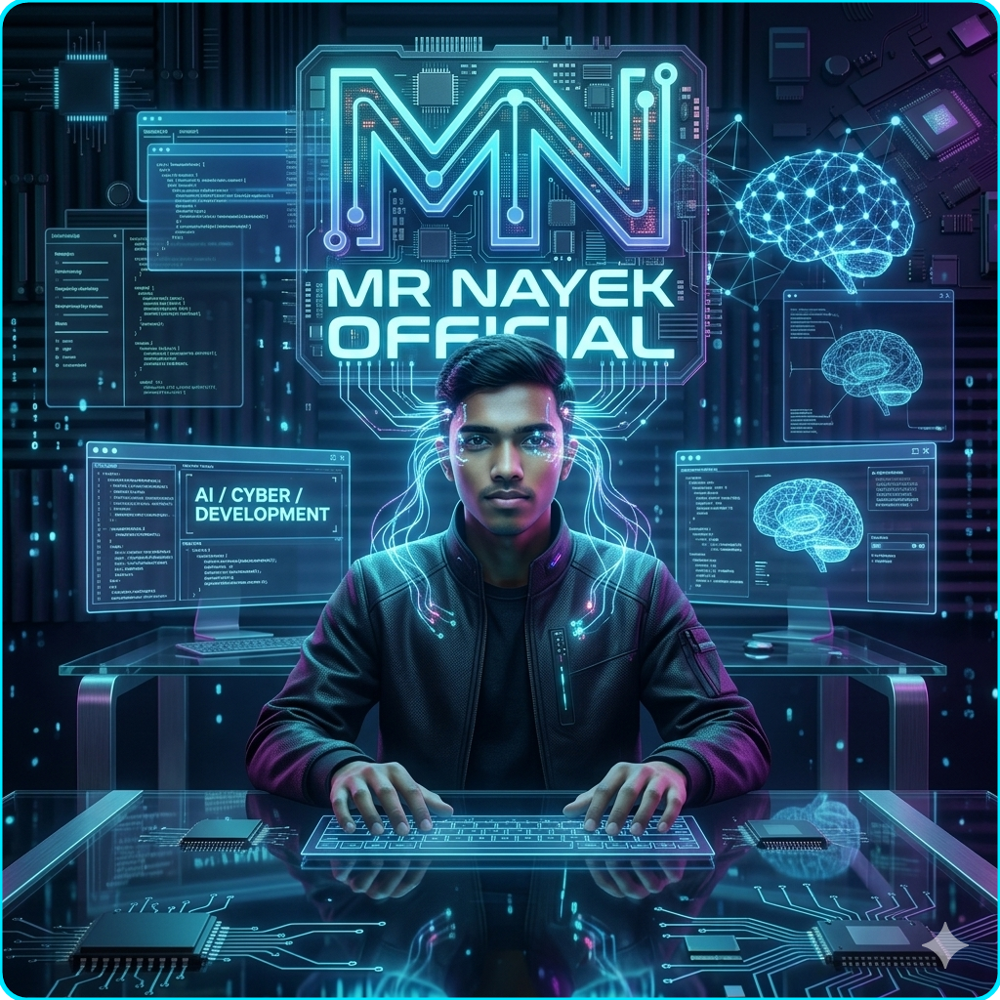

<div align="center">


</div>

<p align="center">
  
</p>

<p align="center">
  
</p>

<p align="center">
  
</p>

<p align="center">
  
</p>

<p align="center">
  
  
  <br/>
  
</p>

<p align="center">
  
  
</p>

<p align="center">
  <a href="https://github.com/MrNayekOfficial?tab=repositories">
    
  </a>
  <a href="https://github.com/MrNayekOfficial?tab=followers">
    
  </a>
</p>

## 〔 QUICK NAVIGATION 〕

<p align="center">
  <a href="#nexus-control"></a>
  <a href="#featured-projects"></a>
  <a href="#auto-live-intel"></a>
  <a href="#open-channel"></a>
</p>

<a id="nexus-control"></a>
## 〔 NEXUS CONTROL PANEL 〕

<p align="center">
  
  
  <br/>
  
</p>

```bash
$ boot_sequence --profile MrNayekOfficial
> [OK] identity handshake complete
> [OK] toolchain online: C / Python / Unix

$ security_scan --mode elite
> [PASS] shell hardening active
> [PASS] repo signal stable

$ deploy_directive --now
> [RUN] ship reliable systems, every week
```

<p align="center">
  <b><code>"Code that survives pressure is the only code worth shipping."</code></b>
</p>

## 〔 OPERATOR CARD 〕

<p align="center">
  
</p>

<p align="center">
  <sub><b>PRIMARY OPERATOR</b></sub><br/>
  <code>@MrNayekOfficial</code>
</p>

```yaml
operator: Biswajit Nayek
designation: Elite Builder
channel: MrNayekOfficial
location: India
focus: ["C Systems", "Python", "Unix"]
status: "Active - Shipping weekly"
```

<p align="center">
  
  
  <br/>
  
</p>

<p align="center">
  
  
  <br/>
  
</p>

<p align="center">
  
</p>

<br/>
<p align="center">
  
</p>

<br/>
## 〔 SYSTEM IDENTITY 〕

```bash

  $ whoami                                                
  > BISWAJIT NAYEK  --  @MrNayekOfficial                  
                                                          
  $ cat /etc/profile                                      
  > NAME    : Biswajit Nayek                              
  > ROLE    : CS Student | C & Python Developer            
  > BASE    : India                                       
  > STACK   : C / Python / Unix                            
  > TRACK   : Core Programming + DSA + Open Source         
  > MISSION : Engineer the next era, one commit at a time 
                                                          
  $ uptime                                                
  > Continuously building since day one. No downtime.    

```
## 〔 SKILL MATRIX 〕

```rust
impl Developer for MrNayekOfficial {
  fn languages()  -> Vec<&'static str> { vec!["C","Python"] }
  fn systems()    -> Vec<&'static str> { vec!["Unix","Linux","Bash"] }
  fn toolchain()  -> Vec<&'static str> { vec!["Git","GitHub","VS Code"] }
  fn currently()  -> Vec<&'static str> { vec!["C Programming","Python Projects","DSA"] }
  fn superpower() -> &'static str      { "Building strong fundamentals with C, Python, and Unix." }
}
```

## 〔 TECH ARSENAL 〕

<p align="center">
  
</p>

<br/>
<p align="center">
  
</p>

<br/>
<a id="featured-projects"></a>
## 〔 FEATURED PROJECTS 〕

<!-- FEATURED-PROJECTS:START -->
<p align="center">
  <a href="https://github.com/MrNayekOfficial/MrNayekOfficial">
    
  </a>
</p>

<p align="center">
  <a href="https://github.com/MrNayekOfficial?tab=repositories">
    
  </a>
</p>
<!-- FEATURED-PROJECTS:END -->

<br/>
<p align="center">
  
</p>

<br/>
## 〔 PROOF OF WORK 〕

<p align="center">
  
</p>

<p align="center">
  
</p>

<p align="center">
  
</p>

## 〔 ACTIVITY GRAPH 〕

<p align="center">
  
</p>

## 〔 CONTRIBUTION SNAKE 〕

<p align="center">
  <picture>
    <source media="(prefers-color-scheme: dark)" srcset="https://raw.githubusercontent.com/MrNayekOfficial/MrNayekOfficial/output/github-contribution-grid-snake-dark.svg" />
    <source media="(prefers-color-scheme: light)" srcset="https://raw.githubusercontent.com/MrNayekOfficial/MrNayekOfficial/output/github-contribution-grid-snake.svg" />
    
  </picture>
</p>

## 〔 DOMINANCE BOARD 〕

<p align="center">
  
</p>

<p align="center">
  
</p>

<br/>
<p align="center">
  
</p>

<br/>
## 〔 MR NAYEK OFFICIAL BRAND CORE 〕

<p align="center">
  
</p>

<p align="center">
  
</p>

<p align="center">
  
  
  <br/>
  
  
</p>

<p align="center">
  
</p>

<p align="center">
  
  
  
</p>

<p align="center">
  <b><code>"This is not a profile card. This is a live command center for serious building."</code></b>
</p>

<p align="center">
  
</p>

## 〔 TROPHY VAULT 〕

<p align="center">
  
</p>

<p align="center">
  
</p>

<p align="center">
  
  
</p>

<p align="center">
  <a href="https://github.com/MrNayekOfficial?tab=repositories">
    
  </a>
</p>

<p align="center">
  
</p>

<br/>
<p align="center">
  
</p>

<br/>
## 〔 CURRENT BUILD FOCUS 〕

```text
  C SYSTEMS CORE          [########--] 80%
  PYTHON PROJECT SHIPS    [#######---] 70%
  DSA EXECUTION TRACK     [######----] 60%
  OPEN SOURCE CONSISTENCY [#####-----] 50%
```

<p align="center">
  
</p>

<br/>
<p align="center">
  
</p>

<br/>
## 〔 30-DAY DELIVERY MAP 〕

```text
  WEEK 01   Foundation Sprint     -> C/Python core module shipped
  WEEK 02   Feature Build         -> CLI/API feature with docs
  WEEK 03   Performance + Testing -> optimization pass + test coverage
  WEEK 04   Release + Devlog      -> final release and public write-up
```

<p align="center">
  
  
</p>

<br/>
<p align="center">
  
</p>

<br/>
<a id="auto-live-intel"></a>
## 〔 AUTO LIVE INTEL 〕

<!-- AUTO-DATA:START -->
### Live Account Snapshot

- Profile: [@MrNayekOfficial](https://github.com/MrNayekOfficial)
- Followers: 6
- Following: 11
- Public repos: 1
- Total stars (owned repos): 1
- Profile updated: 2026-04-07

### Top Starred Repositories

- [MrNayekOfficial](https://github.com/MrNayekOfficial/MrNayekOfficial) - 1 stars

### Recently Updated Repositories

- [MrNayekOfficial](https://github.com/MrNayekOfficial/MrNayekOfficial) - pushed 2026-04-16

### Recent Public Activity

- No recent public activity found.

_This section is auto-updated every 6 hours by GitHub Actions._
<!-- AUTO-DATA:END -->

<br/>
<p align="center">
  
</p>

<br/>
## 〔 MISSION TIMELINE 〕

```text
  
  PHASE 01    [COMPLETE]   DSA Foundations
  PHASE 02    [ACTIVE  ]   C and Python Development
  PHASE 03    [LOADING ]   Open Source Contribution
  PHASE 04    [LOCKED  ]   Cybersecurity Depth
  
  CURRENT DIRECTIVE >  Ship production code. Every. Single. Week.
```

<p align="center">
  
</p>

## 〔 2026 EXECUTION ORDERS 〕

```diff
+ [SHIP]   Build 3 strong C/Python projects
+ [CODE]   Solve 500+ DSA problems with precision and speed
+ [GIVE]   Contribute meaningful PRs to 10+ open-source repos
+ [GROW]   Publish high-quality content on MrNayekOfficial Coding
+ [LOCK]   Complete cybersecurity fundamentals via hands-on labs
```

## 〔 STAR PROTOCOL 〕

<p align="center">
  <b>
    If this profile gave you value — hit a star on any repo.<br/>
    It tells me the work matters. It fuels the next build.
  </b>
</p>

<p align="center">
  <a href="https://github.com/MrNayekOfficial?tab=repositories">
    
  </a>
</p>

<br/>
<p align="center">
  
</p>

<br/>
<a id="open-channel"></a>
## 〔 OPEN CHANNEL 〕

<p align="center">
  <a href="https://github.com/MrNayekOfficial"></a>
  <a href="https://www.linkedin.com/in/mrnayekofficial"></a>
  <br/>
  <a href="https://x.com/MrNayekOfficial"></a>
  <a href="https://www.youtube.com/@MrNayekOfficial"></a>
  <br/>
  <a href="https://www.instagram.com/MrNayekOfficial"></a>
  <a href="mailto:mrnayekofficial@gmail.com"></a>
</p>

<p align="center">
  <b>For collaboration, send scope + timeline on email.</b><br/>
  <code>Preferred: project build, automation, C/Python systems, debugging support.</code>
</p>

<p align="center">
  
  
</p>

<p align="center">
  <b><code>"The era doesn't shape me. I shape the era."</code></b>
</p>

<p align="center">
  
</p>

<p align="center">
  
</p>
